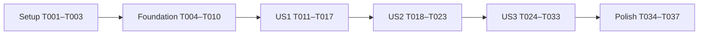

# Tasks: Proteger límites de aforo

**Input**: Artefactos de `specs/001-proteger-limites-aforo/`.
**Branch**: `001-proteger-limites-aforo`.
**Prerequisites**: [plan.md](plan.md), [spec.md](spec.md), [research.md](research.md), [data-model.md](data-model.md), [API](contracts/event-configuration.md), [PostgreSQL](contracts/database-capacity.md) y [quickstart.md](quickstart.md).

**Tests**: Incluidos porque la spec exige pruebas independientes por historia, escenarios numéricos y pruebas de simultaneidad en SC-004. Son pruebas de comportamiento, upgrade y concurrencia previstas en el plan. Escribir los escenarios antes de integrar cada historia; los criterios ya cumplidos pueden pasar desde el inicio y deben conservarse como regresiones.

**Organization**: Setup → infraestructura común → US1 → US2 → US3 → verificación transversal. Las tres historias tienen prioridad P1. La infraestructura SQL sirve a las tres y se implementa una sola vez; las fases de historia conectan y verifican sus recorridos independientes.

**Implementation gate**: BLOCKED. El Constitution Check del plan es FAIL por incumplimientos heredados de II, III, IV (publicación) y V. T001 debe comprobar una resolución explícita y revisada antes de liberar T002–T037; registrar deuda o no introducir regresiones no basta. Estos ajustes no modifican la constitución ni autorizan una ampliación automática de alcance.

## Format: `[ID] [P?] [Story] Description`

- Cada tarea usa checkbox, ID secuencial y ruta concreta.
- `[P]` señala trabajo en archivos distintos que puede liberarse en la misma ventana indicada en dependencias; no autoriza saltarse prerrequisitos.
- `[US1]`, `[US2]`, `[US3]` aparecen únicamente en las fases de historia.
- Rutas de código relativas a la raíz; archivos de diseño relativos a esta carpeta.

## Path Conventions y límites del alcance

- Rutas en `app/`; tipos/helpers compartidos en `lib/`; clientes Supabase en `lib/supabase/`.
- Una migración nueva de producto: `supabase/migrations/20261002120000_protect_capacity_limits.sql`. Las once migraciones preexistentes se usan como referencia y no se editan. Completar T006–T007 antes de aplicar la nueva; después de aplicarla, cualquier corrección DDL requiere otra migración nueva.
- Fixture de esquema exclusivamente para instalación aislada de pruebas: `tests/db/fixtures/legacy-project/supabase/migrations/20261002110000_capacity_legacy_fixture.sql`. El runner copia el historial y esta migración al proyecto local de pruebas; no la aplica al proyecto de desarrollo/producto.
- Configurar el cupo numérico obligatorio declara un límite estricto; todos los valores heredados se interpretan como límites configurados. No añadir modo, tablas, columnas ni contadores nuevos. Conservar significado de Event, TicketType, Registration y Ticket (FR-003, US1.6).
- Cada Registration ocupa cupo una sola vez, incluidas las asociadas a Tickets revocados. Métricas/lista operativa existentes no son el mínimo autoritativo.
- Las desviaciones constitucionales heredadas registradas en la spec mantienen el gate en FAIL. Su corrección requiere specs y cambios revisados, o una enmienda constitucional separada; no se adopta ninguna de esas decisiones ni una excepción en estas tareas.

## Phase 1: Setup (Shared Infrastructure)

**Purpose**: Preparar trabajo incremental y herramientas locales reutilizando el proyecto existente.

- [ ] T001 Verificar primero en `specs/001-proteger-limites-aforo/spec.md`, `specs/001-proteger-limites-aforo/plan.md` y `.specify/memory/constitution.md` una resolución explícita y revisada de los conflictos II/III/IV-publicación/V y reevaluar el gate sin incumplimientos abiertos; no completar esta tarea ni iniciar T002–T037 mientras siga FAIL. La resolución debe proceder de specs/correcciones verificadas o de una enmienda constitucional separada con motivo e impacto, no de marcar deuda como PASS. Después, contrastar las versiones de `package-lock.json`, baseline/delta del plan, triggers y `register_for_event` de `supabase/migrations/20260905120000_rename_tickets_types_to_ticket_types.sql`, editor `app/organizer.tsx` y mensaje de `lib/errors.ts`; consultar Context7 antes de código de framework/SDK/CLI y `.agents/skills/door-list-ui/SKILL.md` para feedback, manteniendo `app/organizador/page.tsx` servidor.
- [ ] T002 [P] Crear `tests/db/local-capacity-environment.mjs` para los dos runners DB: obtener configuración local sin imprimir secretos, validar host local, gestionar sesiones `psql`/transacciones, timeout y limpieza; reutilizar `supabase/config.toml` como referencia sin cambiar la configuración del producto ni aceptar conexiones remotas.
- [ ] T003 [P] Crear fixtures de organizer/Event/TicketType/Registration/Ticket consistentes en `tests/e2e/capacity-fixtures.ts`, con owner y otro usuario, emails únicos, cantidades explícitas y estados `valid`, `used`, `revoked`; reutilizar la infraestructura de `tests/e2e/run.mjs` y Resend simulado, sin enviar correo real ni fabricar legacy deshabilitando nuevas guardas.

**Checkpoint**: Gate constitucional resuelto y revisión registrada; contexto confirmado y helpers de prueba disponibles. No reinicializar Next.js, Auth, Tailwind ni Supabase.

## Phase 2: Foundational (Blocking Prerequisites)

**Purpose**: Construir autoridad, atomicidad y contrato común antes de conectar las historias.

Estas tareas incluyen la lógica SQL de las tres historias porque comparten una única migración y operación transaccional. Terminar esta fase antes de iniciar pruebas/integraciones por historia. No crear implementaciones provisionales que acepten límites sin validación.

T007 implementa FR-012 también para la RPC de solo metadatos y las guardas activadas por asociación de TicketType; T009 debe tratar `0A000` como 500 propio, sin incluirlo entre errores de contención 503. T025 debe comprobar esa traducción mediante simulación de contrato y distinguirla de las pruebas SQL reales de T024/T029.

- [ ] T004 [P] Añadir a `lib/types.ts` los contratos camelCase `EventConfigurationRequest`, `EventConfigurationResponse` con «`{ eventId: string; ticketTypeId: string | null }`», `CapacityViolation` con «`scope: "event" | "ticketType"`» y «`reason: "registrationConsumption" | "assignedCapacity"`», y `CapacityErrorDetails` con «`{ kind: "capacityViolation"; version: 1; violations: CapacityViolation[] }`»; reutilizar `ApiErrorResponse` con «`{ error: string }`» sin redefinir las entidades existentes.
- [ ] T005 [P] Crear el cliente por request en `lib/supabase/server.ts` con `@supabase/supabase-js`, JWT Bearer del usuario y validación Auth; usar configuración pública vigente, desactivar persistencia de sesión servidor y no suplir permisos mediante service-role.
- [ ] T006 [P] Crear exclusivamente `supabase/migrations/20261002120000_protect_capacity_limits.sql` con reemplazo de validadores/triggers: consumo BEFORE «`UPDATE OF max_capacity`» en Event y TicketType, sin comparación OLD/NEW; bloqueo de tipo «`INSERT OR UPDATE OF event_id,max_capacity`» antes de contar, Event `FOR UPDATE NOWAIT` y coordinación ordenada de origen/destino para traslado; conteos separados después del lock con bigint y funciones VOLATILE; constraint triggers AFTER `events_capacity_assignment_check` y `ticket_types_capacity_assignment_check`, DEFERRABLE INITIALLY IMMEDIATE, leyendo filas/suma finales y omitiendo filas eliminadas. Mantener «`max_capacity > 0`», «nombre no vacío; cupo > 0», «únicos `(event_id,name)` y `(event_id,id)`», FK/RLS e índices; guardas SECURITY DEFINER con `search_path = ''`, objetos cualificados y ejecución directa revocada; sin backfill, saneamiento ni flags de bypass (FR-001–005, FR-007, FR-009–011).
- [ ] T007 Completar, antes de aplicarla, `supabase/migrations/20261002120000_protect_capacity_limits.sql` con RPC `update_event_configuration(p_request jsonb)`: validar presencia/shape/valores, Auth/owner/pertenencia, bloquear Event→TicketType, contar consumo y suma final después del lock y agregar todas las infracciones en DETAIL versionado `23514`; diferir solo las dos restricciones de asignación, aplicar exclusivamente campos presentes, forzar IMMEDIATE y propagar errores con rollback total. RPC SECURITY INVOKER, VOLATILE y ejecución solo authenticated. Añadir guardia READ COMMITTED en RPC/guardas/`register_for_event`, rechazando otros aislamientos con `0A000` antes de escribir; conservar firma, estados, fechas, emisión y «email normalizado único por evento», «nombre 1–120 y email 3–254/formato vigente», «código aleatorio 32 bytes en hex, único» y «estado `valid`, `used`, `revoked`». No añadir veto global de venta nuevo ni mover/crear/borrar entidades en la RPC (FR-004–010).
- [ ] T008 [P] Implementar en `lib/errors.ts` decoder estricto de DETAIL reconocido/versionado y formatter español de consumo por evento/tipo y suma asignada; agregar todas las causas con sus cifras, nombre del tipo tomado de DB y aclaración de revocadas. Sustituir la inferencia indiscriminada de `23514` en `organizerErrorMessage`; un DETAIL desconocido/malformed o error ajeno debe usar fallback propio, nunca `.message`/`.hint` del proveedor (FR-006, FR-010).
- [ ] T009 Crear `app/api/eventos/[id]/configuracion/route.ts` con PATCH, cliente T005 y RPC T007; validar UUID/JSON/allowlist/request no vacío y constraints «Integer positivo ≤ 2147483647; null, cadenas y fracciones rechazados», «String o null» para description, «Fecha válida con offset, normalizada a UTC» mediante `lib/dates.ts`, «`draft` o `published`» y «Strings no vacíos conforme a validación vigente» para title/venue/name; preservar «título/lugar no vacíos». Comprobar Auth/propiedad antes de cifras, mapear éxito 200 y errores 400/401/403/404/409/503/500 a exclusivamente `{ error: string }`; normalizar `55P03`/`40P01`/`40001` como contención reintentable, sin atribuirla a ventas ni introducir traslados/publicación nueva.
- [ ] T010 Construir en `tests/db/run-capacity-upgrade.mjs` el harness de upgrade por escenario `--story US1`, `--story US2` y `--story US3`, usando T002 para un proyecto local aislado con puertos propios: copiar historial anterior, aplicar la fixture versionada `tests/db/fixtures/legacy-project/supabase/migrations/20261002110000_capacity_legacy_fixture.sql` antes de la protección, guardar snapshots y aplicar solo la nueva migración de producto ya completada en T006–T007. Preparar fixtures de aforo 4/VIP 1/consumo 2, aforo 2/VIP 3/consumo 3 y aforo 3/VIP 10/consumo 2; representar importación previa exclusivamente en esa migración de pruebas y limpiar la instalación, sin rebobinar desarrollo ni deshabilitar las guardas nuevas.

**Checkpoint**: Migración nueva completa y no editable después de aplicación; autoridad/atomicidad disponibles para las tres historias. Cliente de servidor, contratos, errores y endpoint no dependen de UI.

## Phase 3: User Story 1 — Proteger el cupo de un tipo de entrada (Priority: P1)

**Goal**: Rechazar cupos inferiores al consumo, conservar igualdad, explicar mínimo del tipo y permitir metadatos sin exigir saneamiento de un cupo no solicitado.

**Independent Test**: Aforo 3, General cupo/consumo 1/1 y VIP 2/2: pedir VIP 1 rechaza y conserva 2 con mensaje VIP/2. Aforo 4, VIP 3/2: pedir 2 acepta. VIP 5/0: pedir 1 acepta. Tres registros con estados valid/used/revoked cuentan 3. Activar sobre VIP 1/consumo 2 conserva datos; mismo valor explícito falla, 2 acepta.

### Tests for User Story 1

- [ ] T011 [P] [US1] Crear `supabase/tests/capacity_limits.test.sql` con casos US1.1–US1.4 de cupo: fixtures numéricas anteriores, igualdad, cero consumo, conteo único de Registrations sin joins a Tickets y revocadas; verificar límites/estados/filas antes y después, DETAIL con nombre/cifra correcta y rechazo de valores no positivos. Incluir la parte de US1.4 que fija aforo 2/3 con tres registros, usando el backend común, sin depender de casos de US2.
- [ ] T012 [P] [US1] Crear `tests/e2e/capacity-limits.spec.ts` con grupo «US1» usando T003: edición VIP inválida/válida, tres Tickets con estados distintos y cifra 3, inputs preservados, feedback accesible y submit bloqueado; probar crear tipo y traslado permitido de tipo sin registros como regresiones de las vías actuales. Cubrir US1.6: crear VIP con cupo 2 declara límite estricto, dos registros aceptan y el tercero falla; con dos registros, cupo 1 rechaza y 2 acepta. Repetir la interpretación sobre tipo ya existente sin indicador nuevo ni cambios de activación.

### Implementation for User Story 1

- [ ] T013 [US1] Adaptar `saveTicketType` en `app/organizer.tsx` para editar un tipo del mismo evento mediante PATCH T009 con Bearer y payload camelCase; registrar intención/touched de `maxCapacity`, incluirlo aunque vuelva al valor original y omitirlo al editar solo name; no enviar `event_id` sin traslado real. Comprobar `response.ok` antes de interpretar éxito/error y usar la respuesta de ese intento como fuente de cifras.
- [ ] T014 [US1] Conservar en `app/organizer.tsx` creación y traslado existentes por DML Supabase cuando corresponda, con campos de persistencia aislados en ese borde; normalizar sus errores mediante T008, conservar FK vigente de tipos con registros y distinguir contención de rechazo por consumo. No convertir toda edición en un traslado ni inferir éxito de un error técnico.
- [ ] T015 [US1] Implementar estados idle/submitting/success/error del formulario de TicketType en `app/organizer.tsx`: «Guardando tipo de entrada…», controles conflictivos deshabilitados, valores visibles/preservados, error `role="alert"` y éxito `role="status"`; conservar anatomía/tokens existentes y mantener `app/organizador/page.tsx` Server Component.
- [ ] T016 [US1] Añadir al escenario US1 de `tests/db/run-capacity-upgrade.mjs` las aserciones US1.5: migración conserva aforo 4/VIP 1/dos registros y Tickets; establecer VIP 1, incluso mismo valor, falla; 2 acepta; editar solo name con cupo omitido funciona; comparar snapshots sin borrados ni cambios de estado.
- [ ] T017 [US1] Ejecutar los casos US1 de `supabase/tests/capacity_limits.test.sql`, `tests/db/run-capacity-upgrade.mjs --story US1` y `tests/e2e/capacity-limits.spec.ts` mediante el runner local existente; corregir fallos en archivos de esta fase y registrar comandos/resultados en `specs/001-proteger-limites-aforo/quickstart.md`, sin reescribir una migración ya aplicada.

**Checkpoint**: US1 demostrable con fixtures propias y metadatos del tipo; positivo/negativo, revocadas y activación comprobados. Backend común ya protege ambos límites; integración completa del editor de Event sigue en US2.

## Phase 4: User Story 2 — Proteger el aforo total del evento (Priority: P1)

**Goal**: Proteger aforo por consumo total y suma asignada, comunicando cada causa sin confundir cupos con ventas.

**Independent Test**: Aforo 4, General 1/1 y VIP 2/2: aforo 2 rechaza con cifra 3; aforo 3 acepta. Aforo 6 con cupos 3+3 y consumo 1+2: aforo 3 rechaza por suma 6. Legacy aforo 2/VIP 3/consumo 3: activar conserva; mismo aforo 2 falla y 3 acepta.

### Tests for User Story 2

- [ ] T018 [P] [US2] Ampliar `supabase/tests/capacity_limits.test.sql` con US2.1–US2.4: consumo total entre tipos, igualdad 3, rechazo 2 después de otros cambios de cupo, suma 6 con ventas 3 y causas simultáneas de consumo/asignación; verificar DETAIL diferenciado, suma bigint y ningún cambio persistido en rechazos.
- [ ] T019 [P] [US2] Añadir grupo «US2» a `tests/e2e/capacity-limits.spec.ts`: aforo 4→2 rechazado con cifra 3, 4→3 aceptado y aforo 6→3 rechazado por cupos asignados 6; verificar mensaje en una lectura, input preservado y cifras nuevas al reintentar después de otra venta.

### Implementation for User Story 2

- [ ] T020 [US2] Adaptar `saveEvent` en `app/organizer.tsx` para ediciones por PATCH T009 con Bearer, campos camelCase y fecha UTC mediante `lib/dates.ts`; seguir intención/touched del aforo, validar mismo valor solicitado y omitir maxCapacity al editar únicamente título/descripción/fecha/lugar/estado. Conservar creación por la vía vigente, estado/publicación y resultado de `response.ok`; no agregar reglas de calendario/publicación ni usar métricas filtradas como mínimo.
- [ ] T021 [US2] Integrar estados idle/submitting/success/error del formulario Event en `app/organizer.tsx` con «Guardando evento…», controles conflictivos deshabilitados, resumen propio accesible de consumo/asignación, input preservado y éxito; reutilizar T008/T015, sin nuevos estilos arbitrarios ni convertir `app/organizador/page.tsx` en cliente.
- [ ] T022 [US2] Añadir al escenario US2 de `tests/db/run-capacity-upgrade.mjs` las aserciones US2.5: activación conserva aforo 2/VIP 3/tres registros; mismo aforo 2 falla y aforo 3 acepta; editar solo título con aforo omitido funciona sobre legacy; comprobar que no cambian registros ni estados de Ticket.
- [ ] T023 [US2] Ejecutar casos US2 de `supabase/tests/capacity_limits.test.sql`, `tests/db/run-capacity-upgrade.mjs --story US2` y grupo US2 de `tests/e2e/capacity-limits.spec.ts`; repetir grupo US1 solo por cambios compartidos del editor y registrar resultados en `specs/001-proteger-limites-aforo/quickstart.md`.

**Checkpoint**: US2 comprobable con sus propios datos; aforo mínimo por ventas y por asignación produce cifras y causas distintas. US1 permanece operativo.

## Phase 5: User Story 3 — Mantener la regla en todos los cambios (Priority: P1)

**Goal**: Demostrar autoridad fuera del panel, rollback conjunto, protección ante simultaneidad y reintentos con datos confirmados actuales.

**Independent Test**: DML owner VIP 2→1 con dos registros rechaza y conserva 2. Para aforo 4, General 1/1 y VIP 3/1, coordinar venta de segunda VIP y petición conjunta aforo 2/VIP 1: venta primero deja 4/3/consumo total 3 y rechaza edición; edición primero deja 2/1/consumo total 2 y rechaza venta. Para VIP 3/1 y reducción a 1, forzar los mismos dos órdenes.

### Tests for User Story 3

- [ ] T024 [P] [US3] Ampliar `supabase/tests/capacity_limits.test.sql` para US3.1 y contratos SQL/RPC: DML directo owner sin endpoint, mismo valor explícito, metadatos aislados, grants/RLS de anon/otro owner, restricciones diferidas con múltiples updates de fila usando valores finales y fila eliminada antes de flush; comprobar que commit/configuración inválidos no persisten aunque el caller difiera asignación. Para FR-012/US3.5 comprobar `0A000` en RPC de solo metadatos bajo aislamiento no soportado, frente a DML exclusivo de metadatos que no active guardas y conserva comportamiento.
- [ ] T025 [P] [US3] Añadir grupo «US3 API» a `tests/e2e/capacity-limits.spec.ts` con HTTP requests autenticadas a T009: shape/allowlist/null/string/fracción/overflow/request vacío y statuses 400/401/403/404/409/503/500 según contrato; éxito camelCase, error exclusivamente `{ error: string }`, permisos sin cifras, DETAIL desconocido/malformed/`23514` ajeno con fallback. Verificar petición conjunta aforo 3/VIP 1 con consumo total 4/VIP 2 informa ambas cifras y revierte también metadatos; incluir consumo+asignación cuando ambas causas sean reales. Simular errores técnicos solo en pruebas de contrato/UI, sin presentar esa simulación como prueba de bloqueo real.

### Implementation and validation for User Story 3

- [ ] T026 [US3] Crear `tests/db/run-capacity-concurrency.mjs` con T002: dos sesiones psql independientes, barreras que mantengan transacciones/locks abiertos, observación determinista de espera, timeout de fallo, lectura final independiente y limpieza; aceptar solo base local y emitir orden efectivo/resultados sin secretos ni sleeps arbitrarios.
- [ ] T027 [US3] Implementar en `tests/db/run-capacity-concurrency.mjs` ambos órdenes de US3.2 para venta VIP frente a petición conjunta aforo 2/VIP 1; comprobar exactamente aforo 4/VIP 3/tres ventas si venta confirma primero, y aforo 2/VIP 1/dos ventas si edición confirma primero; toda reducción rechazada conserva ambos límites y metadatos.
- [ ] T028 [US3] Implementar en `tests/db/run-capacity-concurrency.mjs` ambos órdenes de US3.3 para VIP 3/consumo 1 y reducción a 1, y DML directo de tipo mientras registro sostiene Event: NOWAIT produce `55P03`, revierte y el reintento completo cuenta ventas confirmadas nuevas; nunca deja cupo 1 con consumo 2 ni espera circular.
- [ ] T029 [US3] Ampliar `tests/db/run-capacity-concurrency.mjs` con regresión venta/venta del mismo cupo, ediciones simultáneas de tipos para suma asignada y eventos distintos independientes. Cubrir FR-012/US3.4–US3.5 en transacciones separadas: READ COMMITTED acepta segunda VIP y posterior cupo 2 desde aforo 4/VIP 3/consumo 1; REPEATABLE READ y SERIALIZABLE rechazan con `0A000` registro, RPC (incluido solo metadatos) y DML de límite, conservando aforo 4/VIP 3/una Registration y Ticket. Comprobar que no se atribuye a falta de cupo ni se reintenta en la misma transacción; iniciar nueva READ COMMITTED funciona según datos actuales. Verificar cantidad de Registrations y Tickets emitidos sin nuevas reglas de venta.
- [ ] T030 [US3] Añadir al escenario US3 de `tests/db/run-capacity-upgrade.mjs` corrección conjunta legacy aforo 3/VIP 10/consumo 2 → 5/5, rollback ante límite inválido y comparación completa de datos de activación; comprobar que las restricciones leen configuración final, no una etapa intermedia, sin capacidades temporales ni bypass de triggers.
- [ ] T031 [US3] Completar en `app/organizer.tsx` el reintento tras contención/servicio indisponible o rechazo con pantalla obsoleta: conservar inputs, liberar estados de envío, mostrar copy propio y usar cifras de cada nueva respuesta en ambos formularios y vías DML conservadas; no guardar/cachar mínimos ni mostrar error técnico como venta insuficientemente cubierta.
- [ ] T032 [US3] Ejecutar la suite SQL de `supabase/tests/capacity_limits.test.sql`, el escenario US3 de `tests/db/run-capacity-upgrade.mjs` y contratos del grupo «US3 API» de `tests/e2e/capacity-limits.spec.ts`; comprobar rollback total, mensajes múltiples y permisos, registrando evidencia en `specs/001-proteger-limites-aforo/quickstart.md`.
- [ ] T033 [US3] Ejecutar `tests/db/run-capacity-concurrency.mjs` con ambos órdenes de todas las carreras previstas y repetir reintento con nuevas ventas mediante `tests/e2e/capacity-limits.spec.ts`; registrar estado inicial/final y ausencia de sobreconsumo en `specs/001-proteger-limites-aforo/quickstart.md`, no solo que las promesas HTTP terminaron.

**Checkpoint**: Las tres historias son funcionales y verificadas; protección independiente del panel, mensajes conjuntos, legacy y concurrencia demostrados.

## Phase 6: Polish & Cross-Cutting Concerns

**Purpose**: Cerrar validación y documentación sin expandir alcance.

- [ ] T034 [P] Actualizar `README.md` y `specs/001-proteger-limites-aforo/quickstart.md` con comandos realmente disponibles, selección `--story`, prerrequisitos locales y resultados reales; retirar afirmaciones de que los runners implementados aún no existen y mantener referencias a contratos/modelo, sin SQL suelto de esquema ni instrucciones contra proyectos remotos.
- [ ] T035 Ejecutar `npm run lint`, `npm run build`, pgTAP/upgrade/concurrencia y `npm run test:e2e -- capacity-limits.spec.ts registration-to-check-in.spec.ts` según `specs/001-proteger-limites-aforo/quickstart.md`; comprobar regresión publicar→registrar→email→QR→check-in y conservar unicidad, fechas, lista operativa y estados, corrigiendo solo fallos atribuibles al cambio.
- [ ] T036 Revisar teclado, foco, anuncio de errores/éxito y pantalla estrecha del editor `app/organizer.tsx` conforme `.agents/skills/door-list-ui/SKILL.md`; verificar mensajes largos/múltiples con nombres y cifras en una lectura, sin nuevos valores visuales arbitrarios ni cambios de páginas a cliente, y registrar el resultado en `specs/001-proteger-limites-aforo/quickstart.md` (SC-003, SC-005).
- [ ] T037 Contrastar diff y evidencia final con `specs/001-proteger-limites-aforo/spec.md`, `specs/001-proteger-limites-aforo/plan.md` y `.specify/memory/constitution.md`: FR-001–012 y SC-001–005 satisfechos, RLS preservada, datos legacy intactos al activar, y ninguna migración preexistente de `supabase/migrations/` editada; registrar en `specs/001-proteger-limites-aforo/quickstart.md` evidencia y reevaluación de la resolución constitucional de T001. No declarar completo ni aprobar el cambio si vuelve a existir un conflicto MUST; registrar deuda pendiente no lo resuelve.

## Dependencies & Execution Order

### Phase Dependencies



- T001 bloquea todas las tareas restantes hasta resolver y reevaluar el gate constitucional. Después, Setup prepara el contexto y dos helpers independientes; todas las historias esperan el checkpoint de Foundation.
- Dentro de Foundation: T004/T005/T006 pueden trabajarse juntos después de Setup; T007 depende de T006 y comparte migración; T008 depende de T004 y puede coincidir con T007; T009 espera T005/T007/T008; T010 usa T002 y la migración completa T006–T007. Solo aplicar la migración cuando T006–T007 estén terminados.
- US1: T011/T012 pueden escribirse juntas; T013→T014→T015 comparten editor; T016 usa T010; T017 espera todas las tareas US1.
- US2: T018/T019 pueden escribirse juntas después de US1; T020→T021 comparten editor; T022 usa T010/T016; T023 espera todas las tareas US2.
- US3: T024/T025 pueden escribirse juntas después de US2; T026→T027→T028→T029 comparten runner; T030 usa el harness T010 y los escenarios US1/US2; T031 espera integración de ambos formularios. T032 espera T024/T025/T030/T031; T033 espera T026–T029/T031 y las comprobaciones de contrato T032.
- Polish: T034 puede avanzar mientras se realiza verificación T035 en archivos distintos, una vez concluidas las historias; T036 aprovecha aplicación funcional y T037 espera T034–T036.

### User Story Dependencies

US1/US2 comparten el mismo editor, formatter, endpoint y pruebas; por ello su integración se realiza en orden y no se marca como paralela. US3 verifica la combinación completa y requiere ambas integraciones. Cada historia mantiene fixtures, grupo de pruebas y criterio independiente: no exige ejecutar el recorrido funcional de otra historia para preparar datos.

No aplicar una migración parcial en US1 para reescribirla después en US2/US3: todo SQL de producto queda completo en Foundation. Las tareas posteriores integran/verifican ese SQL, y cualquier corrección posterior a aplicación se añade en otra migración nueva.

## Parallel Example: User Story 1

Después del checkpoint Foundation:

```text
T011: casos SQL de cupo en supabase/tests/capacity_limits.test.sql
T012: casos E2E de cupo en tests/e2e/capacity-limits.spec.ts
```

Archivos diferentes y fixtures/helpers disponibles. Después, T013–T015 se ejecutan en secuencia sobre `app/organizer.tsx`.

## Parallel Example: User Story 2

Después del checkpoint US1:

```text
T018: casos SQL de aforo en supabase/tests/capacity_limits.test.sql
T019: casos E2E de aforo en tests/e2e/capacity-limits.spec.ts
```

No ejecutar T018 junto a T011 ni T019 junto a T012: las dos historias reutilizan los mismos archivos.

## Parallel Example: User Story 3

Después del checkpoint US2:

```text
T024: DML, permisos y restricciones en supabase/tests/capacity_limits.test.sql
T025: contrato HTTP conjunto en tests/e2e/capacity-limits.spec.ts
```

T026–T029 comparten el runner de concurrencia y se ejecutan en orden. Preparar casos en paralelo no implica ejecutar fixtures sobre la misma base simultáneamente; las carreras se controlan dentro del runner dedicado.

## Implementation Strategy

### MVP First

Completar Setup y Foundation, integrar US1 y ejecutar T017. Esto demuestra el fallo inicial de VIP, igualdad, revocadas y preservación de datos. El núcleo común ya contiene protección de aforo/atomicidad para no entregar una migración incompleta. US1 es el MVP demostrable; la feature completa requiere US2 y US3, pues ambas son P1.

### Incremental Delivery

1. Setup/Foundation establecen contratos, SQL y atomicidad compartidos.
2. US1 activa y valida el recorrido de cupo con sus fixtures.
3. US2 activa y valida el recorrido de aforo sin perder US1.
4. US3 demuestra límites por DML/API, ambos órdenes simultáneos, reintentos y rollback.
5. Polish cierra verificaciones reales y documentación. No incluye publicación/despliegue ni tareas ajenas a esta feature.

### Cobertura y trazabilidad

| Spec | Implementación / verificación principal |
|---|---|
| FR-001, FR-002 | T006–T007; T018–T023; T027–T029. |
| FR-003 | T006–T007; T011–T017; T028. |
| FR-004 | T007, T009; T025, T027, T030, T032. |
| FR-005 | T006; T024, T028, T032. |
| FR-006 | T008–T009; T012, T015, T019, T021, T025, T031, T036. |
| FR-007 | T006–T007; T026–T029, T033. |
| FR-008 | T007, T014, T020; T029, T035. |
| FR-009 | T006–T007; T018, T024–T025, T027, T030. |
| FR-010 | T006–T008; T011–T012, T018–T019, T029. |
| FR-011 | T006–T007, T010; T013, T016, T020, T022, T030. |
| FR-012 / US3.4–US3.5 | T007; T009, T024, T029, T032–T035. |
| SC-001, SC-002 | Matrices SQL/UI, upgrade y T035/T037. |
| SC-003, SC-005 | T012, T019, T025, T031, T036. |
| SC-004 | T026–T029, T033. |

## Notes

- 37 tareas: Setup 3; Foundation 7; US1 7; US2 6; US3 10; Polish 4.
- 13 tareas `[P]`, liberadas únicamente en las ventanas descritas. Ningún paralelismo sobre el mismo editor/migración/archivo de pruebas.
- No marcar completa una tarea de validación por haber escrito la prueba; registrar su ejecución y resultado.
- No contar revocadas mediante listas filtradas, cachear mínimos ni corregir legacy durante activación.
- Si la implementación requiere apartarse del diseño, actualizar los artefactos afectados antes de considerarla completa; conservar el historial aplicado de migraciones.
